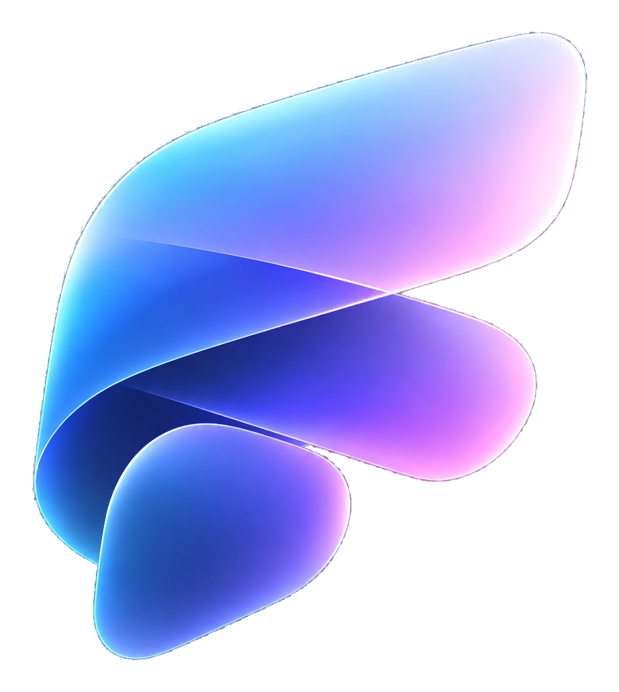
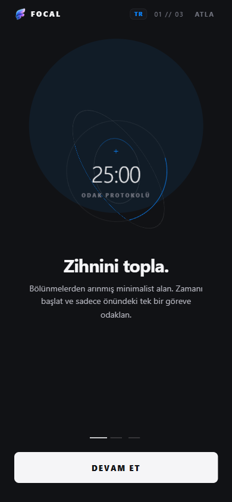
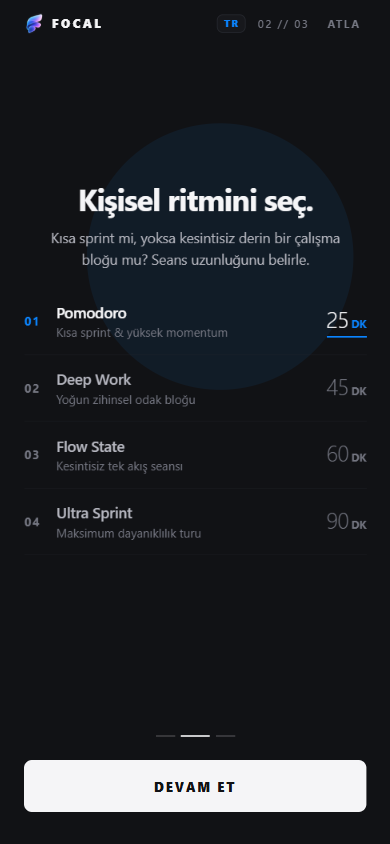
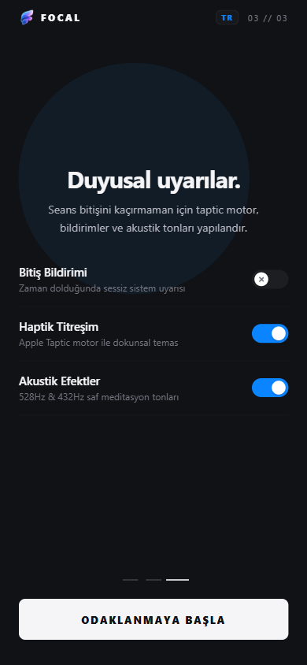
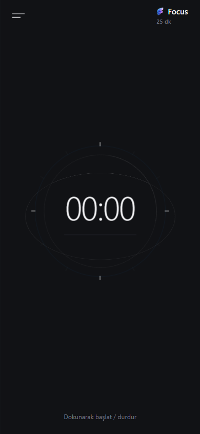
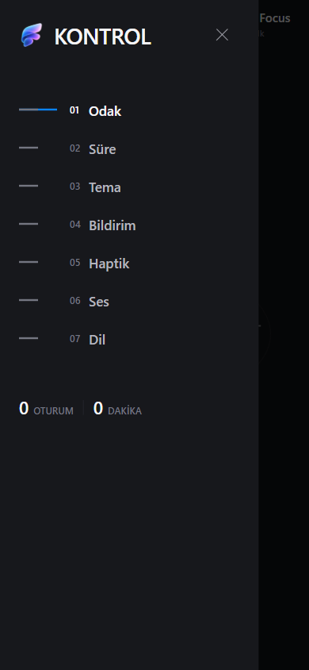
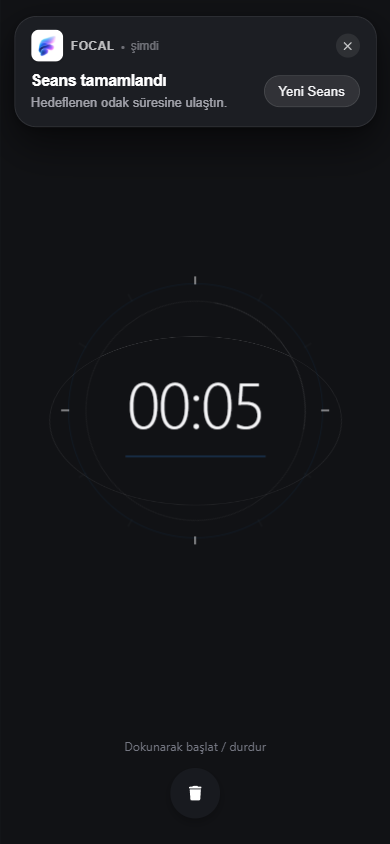

<p align="center">
  
</p>

# FOCAL

Focal is a high-performance, minimalist mobile productivity application engineered with React Native, Expo SDK 57, and Reanimated. Built with Swiss graphic design and Apple Human Interface Guidelines in mind, it provides an uncluttered environment for deep cognitive focus, custom session intervals, procedural audio tonalities, and physical haptic resonance.

---

### Tech Stack & Core Dependencies

<p align="left">
  
  
  
  
  
  
  
</p>

---

### Interface & Flow Showcase

<table>
  <tr>
    <td align="center" width="50%">
      <b>01 // 3D Gyroscope Focus Core</b><br/><br/>
      
    </td>
    <td align="center" width="50%">
      <b>02 // Precision Rhythm Selection</b><br/><br/>
      
    </td>
  </tr>
  <tr>
    <td align="center" width="50%">
      <b>03 // Sensory Feedback Protocols</b><br/><br/>
      
    </td>
    <td align="center" width="50%">
      <b>04 // Minimalist Focus Timer</b><br/><br/>
      
    </td>
  </tr>
  <tr>
    <td align="center" width="50%">
      <b>05 // Architectural Control Drawer</b><br/><br/>
      
    </td>
    <td align="center" width="50%">
      <b>06 // Apple OS Notification & Surface Hierarchy</b><br/><br/>
      
    </td>
  </tr>
</table>

---

### Key Architectural Pillars

#### 1. 3D Spatial Transitions & Gesture Physics
- Interactive 3D carousel transitions leveraging `react-native-reanimated` worklets running directly on the native rendering thread.
- Native perspective projection, continuous horizontal inertia, and smooth mathematical rotations without garbage collection overhead or frame drops.

#### 2. Procedural Audio Synthesis (528Hz & 432Hz)
- Completely local acoustic tone generation for timer ticks and completion chimes.
- Operates zero-network and zero-dependency on external audio CDN files, generating harmonic sine waves and meditation intervals dynamically.

#### 3. Apple Taptic Engine Integration
- Precise tactile communication mapped to timer lifecycle events (start, interval ticks, reset, pause, and step selection).
- Multi-tier feedback patterns using Light, Medium, and Notification haptics.

#### 4. Custom Native SVG Toggle & Reset Architecture
- Engineered `ModernSwitch` component utilizing custom SVG crosshairs and checkmark paths.
- Spring-driven physical travel mechanics with dual-state interpolation for OLED dark and high-contrast light environments.
- Responsive `ModernResetButton` with directional SVG motion and smooth exit animations.

#### 5. Apple OS Notification System & Surface Hierarchy
- Authentic iOS notification banner (`AppleNotificationBanner`) matching Apple HIG metrics: 32px squircle icon with official transparent Focal logo, responsive action pill, pan-to-dismiss gesture, and high-contrast Light/Dark surfaces.
- Scheduled local background notifications via Expo Notifications with zero cloud latency.

#### 6. Dark Mode Surface Hierarchy & Tonal Elevation
- Lifted base surface from pure black (`#000000`) to deep obsidian slate (`#111215`), allowing physical drop shadows to naturally render and avoiding the "detached grey box" artifact.
- Restrained tonal elevation ladder: Base (`#111215`) -> Panel Drawer (`#17181C`) -> Floating System Banner (`#1D1F24`).
- Ultra-thin 1px ambient rim highlight (`rgba(255, 255, 255, 0.09)`) catching specular light without harsh artificial outlines.
- Complete Light Mode invariance preserving original high-contrast daytime fidelity.

#### 7. 60–120 FPS Performance & Motion Architecture
- Full render cascade isolation isolating timer ticks from menus and heavy UI surfaces via `React.memo` and stable callback hooks.
- Static allocation hoisting for 3D gyro coordinates and chronometer ticks.
- Dynamic spring physics tuning: gentle entrance, snappy interruptible dismissal.
- Worklet offloading executing gestures and perspective calculations directly on the native UI thread.

#### 8. Cross-Platform Local Persistence
- Fast key-value persistence with `react-native-mmkv` on iOS/Android and seamless asynchronous fallback on Web runtimes.
- Preserves theme preferences, notification grants, audio states, and cumulative focus analytics across cold boots with backward-compatible legacy key migration.

---

### Project Structure

```
focal/
├── assets/
│   ├── focal-logo.png         # High-resolution transparent official brand mark
│   ├── icon.png               # Square 1024x1024 app store icon on #111215 obsidian
│   ├── android-icon-foreground.png # Android adaptive icon foreground
│   ├── favicon.png            # Web favicon
│   └── screenshots/           # High-resolution application captures
├── src/
│   ├── audio/
│   │   └── soundEngine.ts     # Procedural harmonic sound engine
│   ├── components/
│   │   ├── onboarding/
│   │   │   ├── AmbientGlow.tsx        # Ambient spatial lighting layer
│   │   │   ├── Artwork3D.tsx          # 3D gyro and sensory control stages
│   │   │   ├── OnboardingScreen.tsx   # Master onboarding coordinator
│   │   │   ├── OnboardingSlide3D.tsx  # 3D perspective worklet container
│   │   │   └── types.ts               # Strict TypeScript interface contracts
│   │   ├── ui/
│   │   │   ├── AppleNotificationBanner.tsx # Native iOS-style banner notification
│   │   │   ├── ModernResetButton.tsx       # Fluid interactive reset trigger
│   │   │   └── ModernSwitch.tsx            # Custom animated SVG toggle
│   │   ├── LineSidebar.tsx    # Left-edge vertical navigation indicator
│   │   └── MainFocus3D.tsx    # Kinetic core chronometer
│   ├── i18n/
│   │   └── translations.ts    # Bi-lingual English / Turkish translation dictionary
│   ├── notifications/         # Multi-platform notification scheduler
│   └── storage/               # MMKV and Web local persistence drivers
├── App.tsx                    # Root application entry & state machine
└── package.json
```

---

### Getting Started

#### Prerequisites
- Node.js (v18.0 or newer)
- npm or bun
- Expo Go application on iOS/Android or a configured mobile emulator

#### Installation
```bash
git clone https://github.com/sandrotonal/focus-engine.git
cd focus-engine
npm install
```

#### Development Server
```bash
# Start standard Expo Metro bundler
npx expo start

# Run targeting specific platforms
npx expo start --ios
npx expo start --android
npx expo start --web
```

#### Quality Assurance
```bash
# Static typecheck
npx tsc --noEmit

# Code analysis and linting
npx expo lint
```

---

### License
Distributed under the MIT License. Designed and developed with focus-driven precision.
